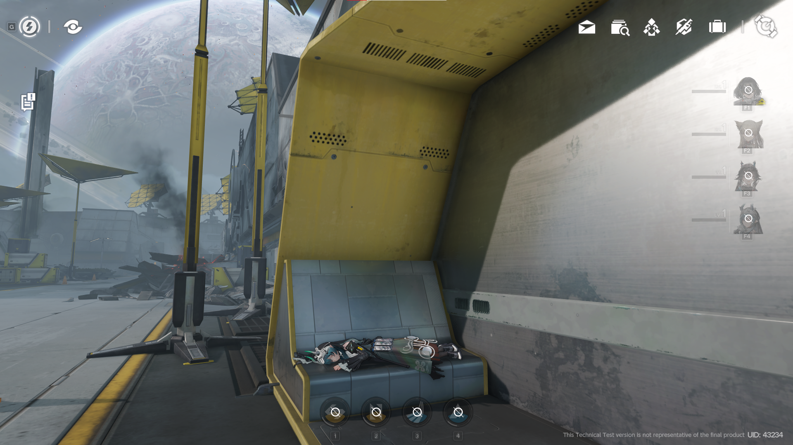

# Perlica RS




<a href="https://discord.gg/AgrhKzhP"></a>

## Features
- Full login sequence with phased data synchronization
- Character bag with teams, skill levels, attributes and normal/ultimate skills
- Complete weapon system (experience feeding, breakthrough levels, gem socket/unsocket, equip/unequip)
- Scene loading, entity management (monsters and characters), revival and checkpoint system
- Authoritative movement with persistent position and rotation
- Bitset system for all progress flags (items, wiki, areas, prts, etc.) (it still doesn't work properly)
- Item bag synchronization
- Bincode-based player persistence with automatic validation
- Configuration-driven new-player defaults (team and spawn location)

#### NOTE: Perlica RS is currently under active development
#### NOTE x2: contributions are always welcome for that read the Contributing section on github
#### NOTE x3: there maybe some protocol defintions that's missing some fields but haven't been fixed if so report this and we'll fix it immediately so you don't waste time debugging errors that aren't your fault

## Getting started

### Requirements
- [Rust 1.85+](https://www.rust-lang.org/tools/install)

### Setup

#### a) Building from sources
```sh
git clone https://github.com/Yoshk4e/perlica-rs.git
cd perlica-rs
cargo build --bin perlica-config-server --release
cargo build --bin perlica-game-server --release
````

#### b) Using pre-built binaries

Download the latest release from the repository releases page and run the server binaries.

### Configuration

The server uses a single configuration file located at the project root: `Config.toml` (created or copied from `servers/game-server/config.default.toml` on first run).

Key sections:

* `[server]` — network binding (default: 0.0.0.0:1337)
* `[assets]` — path to your dumped JSON tables
* `[world_state]` — new-player spawn location and level
* `[default_team]` — starting team composition

Example:

```toml
[server]
host = "0.0.0.0"
port = 1337

[assets]
path = "assets"

[world_state]
last_scene = "map01_lv001"
pos_x = 469.0
pos_y = 107.11
pos_z = 217.83

[default_team]
team = [
    "chr_0013_aglina",
    "chr_0004_pelica",
    "chr_0005_chen",
    "chr_0006_wolfgd"
]
```

### Running the server

```sh
cargo run --bin perlica-config-server --release
cargo run --bin perlica-game-server --release
```

Or directly:

```sh
./target/release/perlica-config-server
./target/release/perlica-game-server
```

The server will listen on the configured address and is ready for client connections.

### Logging in

The server is compatible with the alpha client.
for more information about this consider joining the discord server.

To connect to the local server, you must apply the provided [client patch](https://github.com/Yoshk4e/beyond-patch-universal).(its shit yes but idfc)
It replaces the server address with a custom one so the client can communicate with the server.

## Development notes

* Command handlers are registered via the central `handlers!` macro in `servers/game-server/src/net/router.rs`.
* Logging starts at DEBUG level with a startup banner for easy debugging.
* Player state is automatically validated after loading to maintain consistency.

For questions about the code, refer to the inline module documentation in the source code. Other than that, join the Discord server.

## License

This project is licensed under the AGPL-3.0 license
